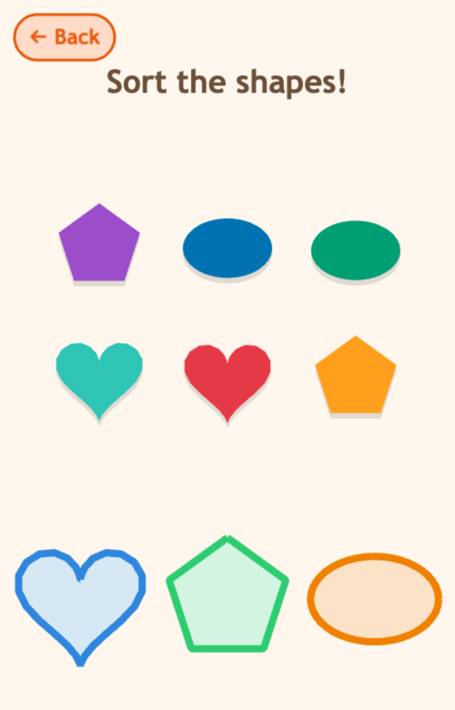
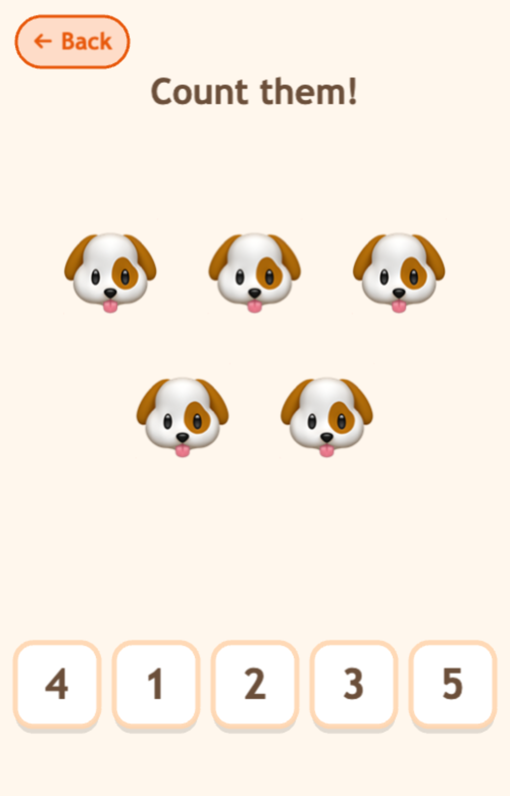
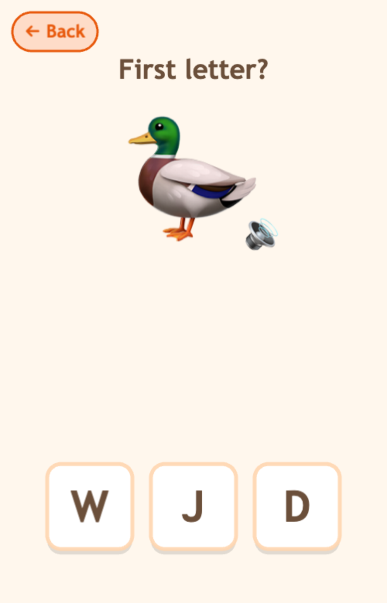
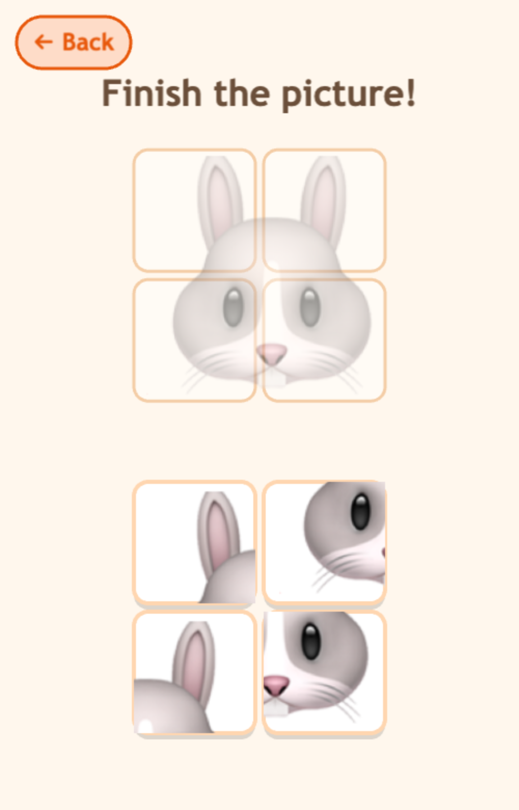
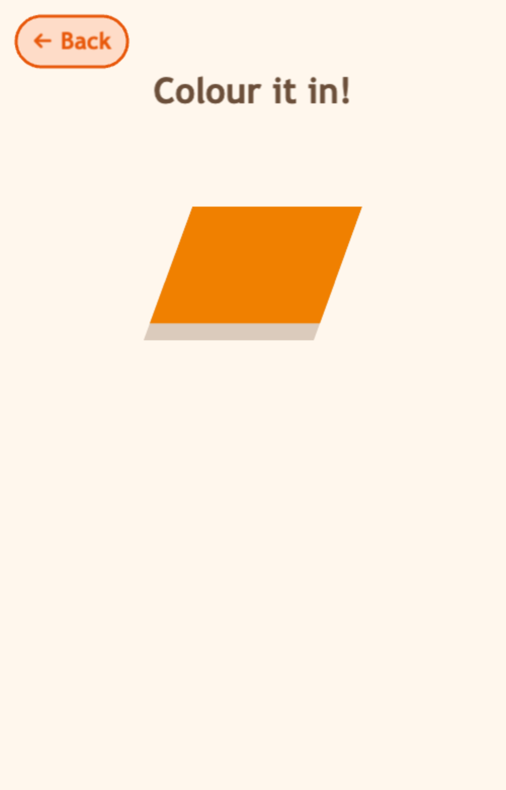
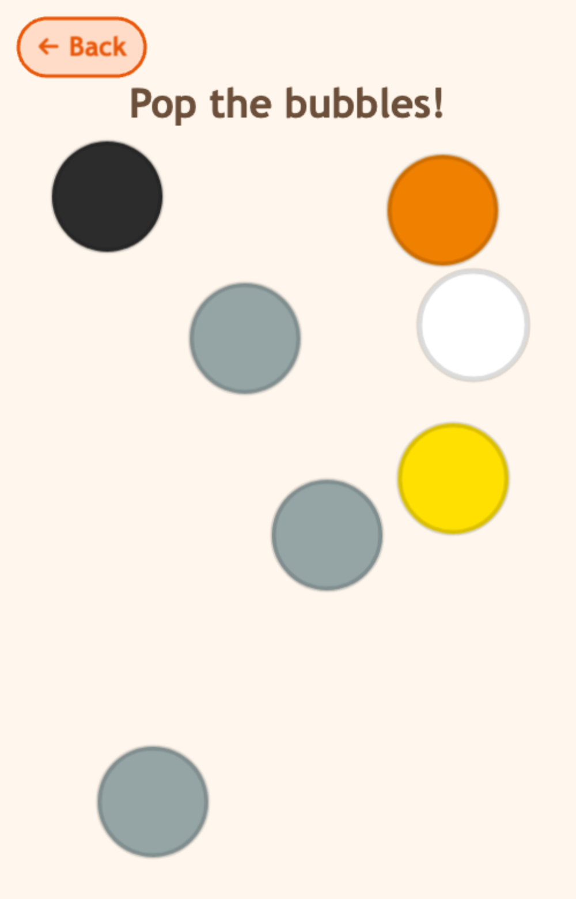
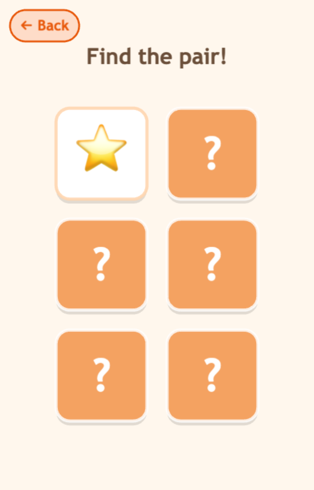

# Ehaan Games 🎨 🧺 🔤 🔢 🫧

Gentle, **offline**, ad-free learning games for **ages 2–5** — sorting, matching, finding, counting, tracing, and a little physics. **21 little games** in one app, with **no ads, no in-app purchases, and no data collection.**

### ▶ Live demo: **https://amims71.github.io/ehaan-games/**

Tap a game and play. Works on phone, tablet, or desktop — best added to your home screen.

> **Prototype note:** the art is emoji + simple vector graphics. The voices are **AI-generated** (an ElevenLabs narrator) and the animal sounds are **AI sound effects** — all bundled, so the app stays fully offline. Final illustrated art is planned and slots into the same code; the mechanics, audio, design, responsiveness, and accessibility are real.

## Screenshots

<p align="center">
  
  
  
</p>
<p align="center">
  
  
  
</p>
<p align="center">
  
  
  
</p>

## The 21 games

| Game | What you do |
|---|---|
| **Colour Sort** | Drag each item into the matching-colour basket |
| **Item Sort** | Sort items into Fruit / Animal / Vehicle baskets |
| **Item Match** | Tap *or drag* the matching pairs |
| **Letter Match** | Match letters & numbers |
| **Find It** | See a letter/number, tap the one that matches |
| **Listen & Find** | *Hear* a letter/number, tap the one that matches |
| **Shape Sort** | Drag each shape onto its matching outline |
| **Size Sort** | Sort the same item into **Big** and **Small** |
| **Shape Match** | Tap/drag the matching shape pairs |
| **Big & Little** | Match uppercase & lowercase letters |
| **Find Colour** | *Hear* a colour, tap it |
| **Find Shape** | Find the named shape |
| **Animal Sounds** | *Hear a real animal sound*, tap the animal |
| **Counting** | Count the objects, tap the number |
| **Patterns** | Tap what comes next in the pattern |
| **First Letter** | Tap the letter a picture starts with |
| **Jigsaw** | Drag the pieces to finish the picture |
| **Colour It** | Trace/colour in a letter, number, or shape |
| **Bubble Pop** | Pop the floating colour bubbles *(physics)* |
| **Catch It** | Catch the falling items in your basket *(physics)* |
| **Find the Pair** | Memory — flip two cards to find matches |

Every round randomises its content, **says the name on success** ("Apple!", "Blue!", "B!"), gives a soft nudge on a wrong tap, and celebrates with a little fanfare.

## Made for little ones

- 🍼 **Younger mode** — fewer items per round and a calmer pace, for the very youngest (toggle on the hub)
- 🔊 **Sound on/off** — one-tap mute (toggle on the hub)
- 🎯 **Drag-forgiveness** — a drop that lands *near* the right basket still counts
- 💡 **Idle hint** — if a child is stuck, the prompt is re-said and the right answer gently pulses
- 🗣️ A warm **narrator voice** says names + an encouraging "Great job!", and **real AI animal sounds** play in Animal Sounds
- **No scores, no timers, no fail states** — just appreciation

## Built with

- **[Phaser 4](https://phaser.io)** (TypeScript) — 2D engine, incl. **Arcade physics** (Bubble Pop & Catch It)
- **[Vite](https://vitejs.dev)** — bundler & dev server; **PWA** (installable, offline)
- **[Capacitor 8](https://capacitorjs.com)** — packages the same codebase into native iOS + Android apps
- Fully **offline**, **zero networking / zero data collection** — kid-safe by design (Apple Kids Category / Google Play Families friendly)

The games share a small reusable engine (a hub, sorting / matching / find bases, audio feedback, persisted settings, and a responsive grid), so new games are mostly content + a thin scene.

## Run locally

```bash
pnpm install
pnpm dev      # http://localhost:5173
pnpm build    # production build → dist/
pnpm test     # unit tests (Vitest)
```

## Mobile (Capacitor)

```bash
pnpm build && npx cap sync
npx cap run android     # or: npx cap run ios  (requires Xcode + an Apple Developer account)
```

> Requires **JDK 21** for the Android build (Capacitor 8). A signed **APK + AAB** is built by CI on every `vX.Y.Z` tag — see [Releases](https://github.com/amims71/ehaan-games/releases).

## License

[MIT](LICENSE)
