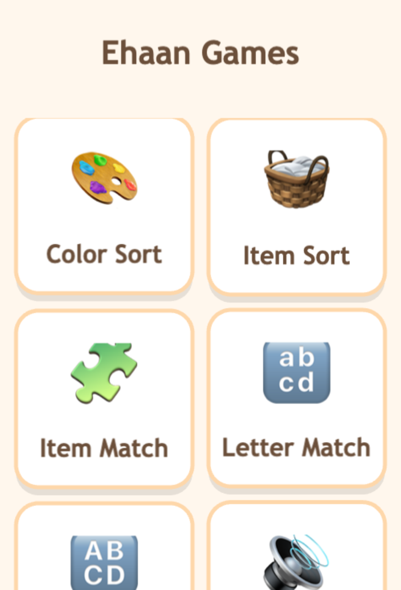
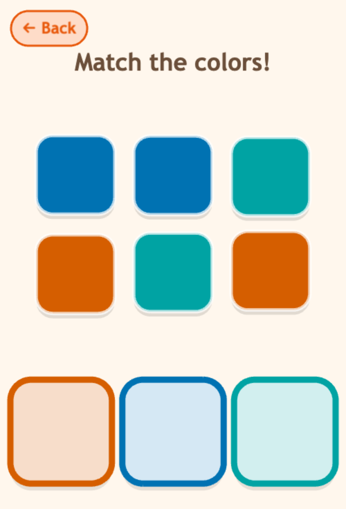
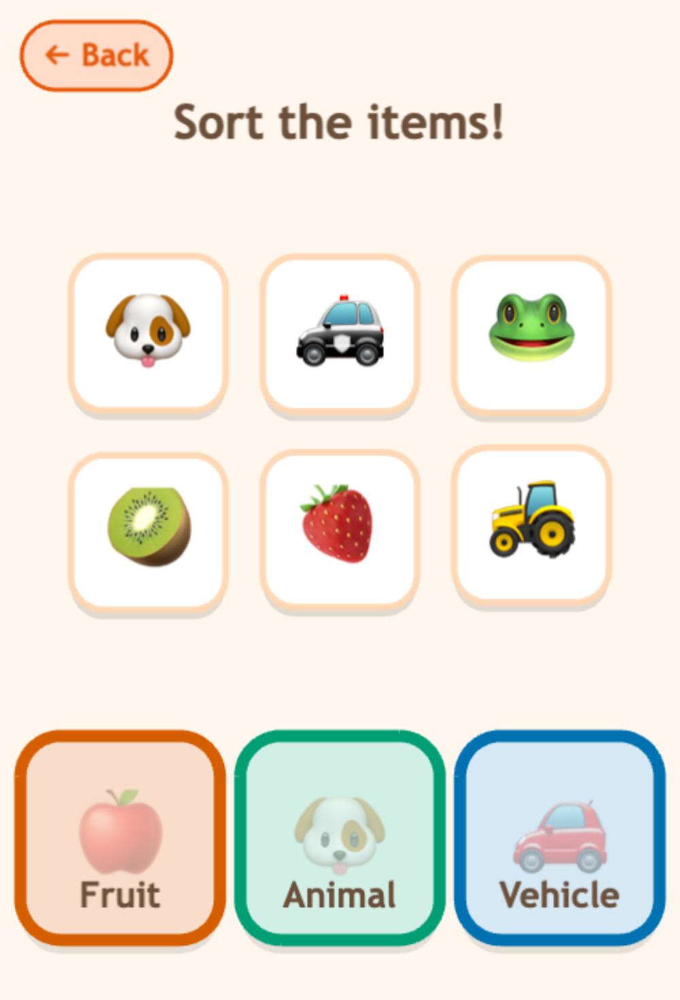
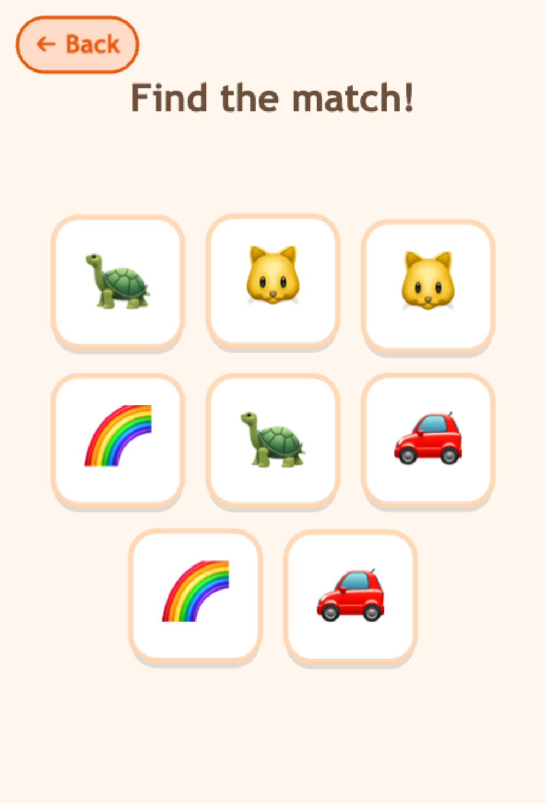
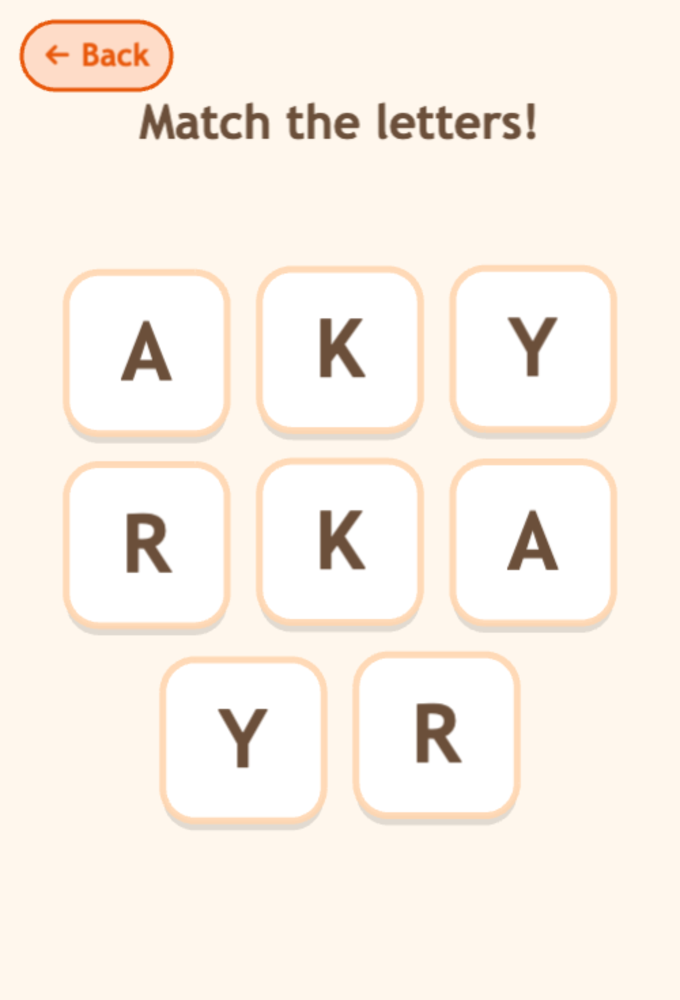
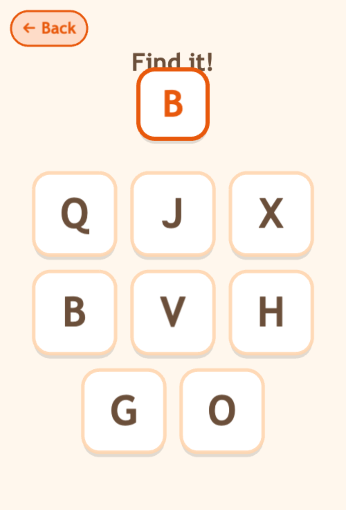
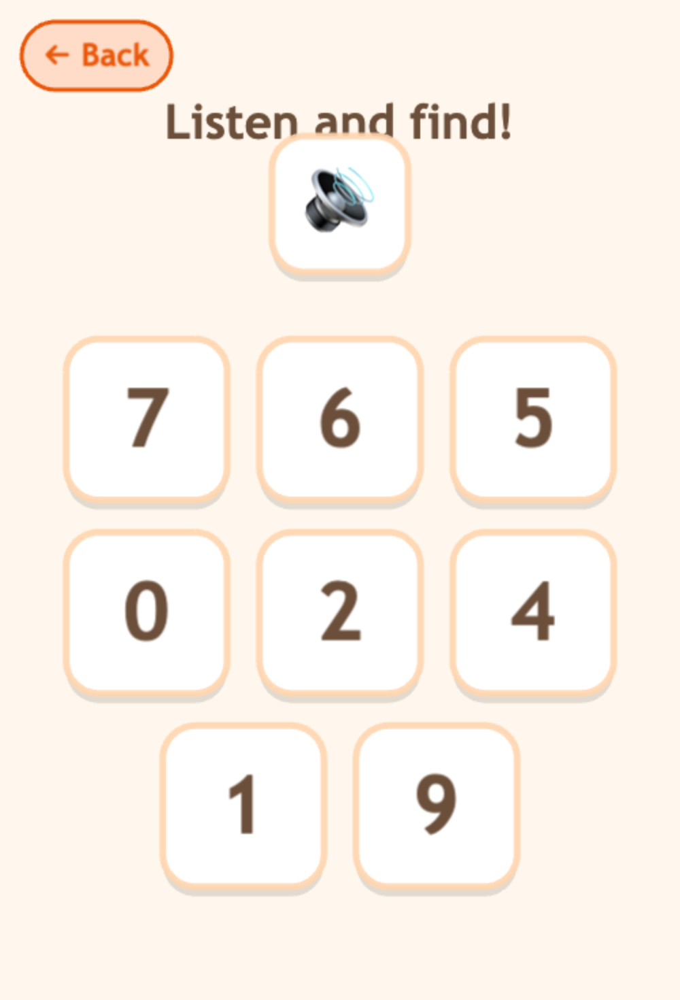

# Ehaan Games 🎨 🧺 🔤 🔢

Gentle, **offline**, ad-free learning games for **ages 2–5** — colour & item sorting, matching, and letter/number games. **No ads, no in-app purchases, no data collection.**

### ▶ Live demo: **https://amims71.github.io/ehaan-games/**

Tap a game and play. Works on phone, tablet, or desktop (best added to your home screen).

> **Prototype note:** the art is emoji + simple vector graphics and the voices are macOS `say` placeholders. Final illustrated art and a warm narrated voice are planned (these slot into the same code). The mechanics, design, responsiveness, and accessibility are real.

## Screenshots

<p align="center">
  
  
  
</p>
<p align="center">
  
  
  
</p>
<p align="center">
  
</p>

## The games

| Game | What you do |
|---|---|
| **Colour Sort** | Drag each item into the matching-colour basket |
| **Item Sort** | Sort items into Fruit / Animal / Vehicle baskets |
| **Item Match** | Tap the matching pairs |
| **Letter Match** | Match letters & numbers |
| **Find It** | See a letter/number, tap the one that matches |
| **Listen & Find** | *Hear* a letter/number, tap the one that matches |

Every round randomises its content, **says the name on success** ("Apple!", "Blue!", "B!"), gives a soft nudge on a wrong tap, and celebrates with a little fanfare.

## Built with

- **[Phaser 4](https://phaser.io)** (TypeScript) — 2D game engine
- **[Vite](https://vitejs.dev)** — bundler & dev server
- **[Capacitor 8](https://capacitorjs.com)** — packages the same codebase into native iOS + Android apps
- Fully **offline**, **zero networking / zero data collection** — kid-safe by design (Apple Kids Category / Google Play Families friendly)

The games share a small reusable engine (a hub, a sorting base, a matching base, a "find" base, audio feedback, and a responsive grid), so new games are mostly content + a thin scene.

## Run locally

```bash
pnpm install
pnpm dev      # http://localhost:5173
pnpm build    # production build → dist/
pnpm test     # unit tests (Vitest)
```

## Mobile (Capacitor)

```bash
pnpm build && npx cap sync
npx cap run android     # or: npx cap run ios  (requires Xcode)
```

> Requires **JDK 21** for the Android build (Capacitor 8).

---

*Prototype — not yet released.*
